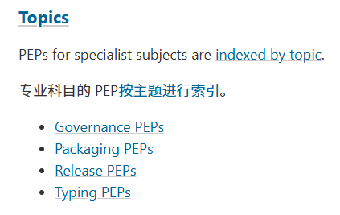

# Paragraph Translator Chrome Extension

This Chrome extension allows you to translate paragraphs on any webpage by hovering over the text and toggle Ctrl/Shift/Alt key.

## Features

- Fast
- Translate paragraphs with triggerKey + hover
- Shows translation below the original text
- Preserves original text
- Uses Google Translate API

## Usage

1. Hover over any paragraph you want to translate
2. Toggle the triggerKey key
3. The translation will appear below the original text

## Sample

